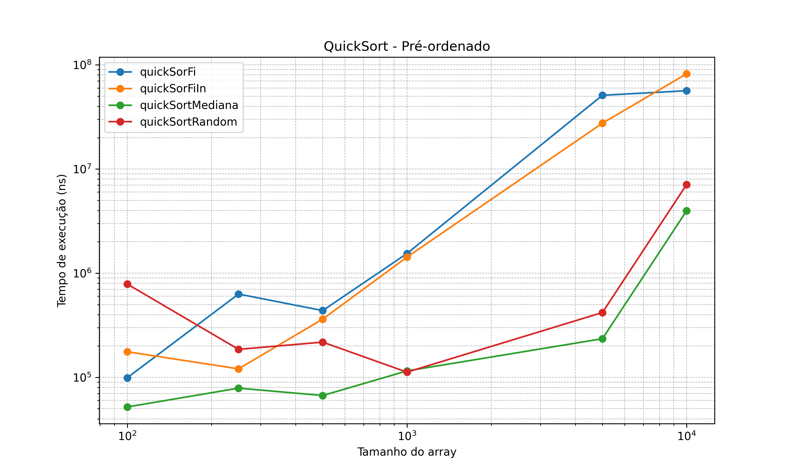
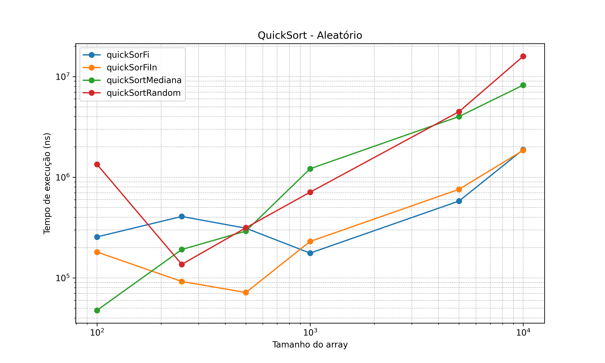
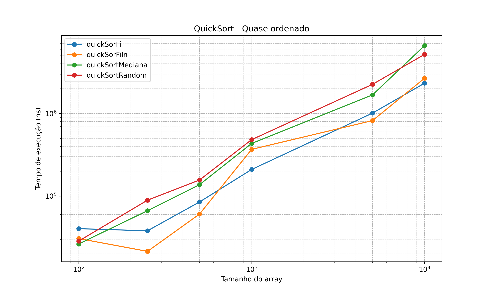

# **Relatório de Análise das Estratégias de Pivô no QuickSort**

## **1. Introdução**

O QuickSort é um algoritmo de ordenação eficiente, amplamente utilizado devido à sua complexidade média de tempo de execução **O(n log n)** e à simplicidade de sua implementação recursiva.
O desempenho do QuickSort, no entanto, depende diretamente da escolha do **pivô** em cada chamada recursiva. Uma escolha inadequada pode gerar **partições desbalanceadas**, resultando no pior caso de complexidade **O(n²)**, enquanto uma escolha estratégica melhora a eficiência.

Este estudo compara quatro estratégias de escolha de pivô:

1. **Último elemento (`quickSorFi`)**
2. **Primeiro elemento (`quickSorFiIn`)**
3. **Mediana de três elementos (`quickSortMediana`)**
4. **Pivô aleatório (`quickSortRandom`)**

O objetivo é avaliar o desempenho de cada estratégia em diferentes tipos de dados e tamanhos de arrays.

---

## **2. Metodologia**

### **2.1 Implementação do Código**

O código foi implementado em **Java**, seguindo a estrutura abaixo:

* **Classe `QuickSort`**:
  Contém métodos separados para cada estratégia de pivô. Também inclui métodos auxiliares para **troca de elementos (`swap`)**, **geração de índice aleatório** e **cálculo da mediana de três elementos**.

* **Métodos de ordenação implementados**:

  * `quickSorFi` → pivô no **último elemento**
  * `quickSorFiIn` → pivô no **primeiro elemento**
  * `quickSortMediana` → **mediana de três elementos** (início, meio, fim)
  * `quickSortRandom` → **pivô aleatório**

* **Classe `QuickSortMain`**:
  Responsável pela geração de arrays de teste:

  * **Pré-ordenados**: elementos sequenciais de 1 a n
  * **Aleatórios**: elementos gerados aleatoriamente dentro de um intervalo \[0, 10n]
  * **Quase ordenados**: elementos sequenciais com um pequeno percentual (5%) trocado aleatoriamente

Para cada array gerado, todas as estratégias de pivô foram testadas, e o **tempo de execução** foi registrado em **nanosegundos (ns)**.

---

### **2.2 Procedimento de Teste**

Foram testados **arrays de tamanhos**: 100, 250, 500, 1000, 5000 e 10000 elementos.
Para cada tipo de array (pré-ordenado, aleatório e quase ordenado), o tempo de execução de cada estratégia de pivô foi registrado.

As medições foram feitas utilizando o método **`System.nanoTime()`**, garantindo precisão no tempo de execução.

---

## **3. Resultados**

### **3.1 Pivô no Último Elemento (`quickSorFi`)**

* **Melhor para:** Arrays **quase ordenados pequenos** (100–250 elementos)
* **Desempenho observado**:

| Tamanho | Pré-Ordenado | Aleatório | Quase Ordenado |
| ------- | ------------ | --------- | -------------- |
| 100     | 99.000       | 255.300   | 40.300         |
| 250     | 630.300      | 407.700   | 38.000         |
| 500     | 437.400      | 311.500   | 84.900         |
| 1000    | 1.542.600    | 176.400   | 210.000        |
| 5000    | 51.044.900   | 579.700   | 1.010.500      |
| 10000   | 56.429.100   | 1.881.800 | 2.328.600      |

**Observações:**

* Extremamente lento em **arrays pré-ordenados grandes**.
* Eficiente em **arrays pequenos quase ordenados** e **arrays aleatórios médios**.

---

### **3.2 Pivô no Primeiro Elemento (`quickSorFiIn`)**

* **Melhor para:** Arrays **aleatórios de tamanho pequeno a médio** (100–500 elementos)
* **Desempenho observado**:

| Tamanho | Pré-Ordenado | Aleatório | Quase Ordenado |
| ------- | ------------ | --------- | -------------- |
| 100     | 176.000      | 180.900   | 30.600         |
| 250     | 120.600      | 92.200    | 21.400         |
| 500     | 362.200      | 71.600    | 60.600         |
| 1000    | 1.424.700    | 230.100   | 367.700        |
| 5000    | 27.555.600   | 758.600   | 820.600        |
| 10000   | 82.087.700   | 1.849.700 | 2.674.200      |

**Observações:**

* Muito lento em **arrays pré-ordenados grandes**.
* Excelente para **arrays aleatórios pequenos/médios**.

---

### **3.3 Mediana de Três (`quickSortMediana`)**

* **Melhor para:** **Pré-ordenados e quase ordenados**, independente do tamanho
* **Desempenho observado**:

| Tamanho | Pré-Ordenado | Aleatório | Quase Ordenado |
| ------- | ------------ | --------- | -------------- |
| 100     | 51.900       | 47.600    | 26.300         |
| 250     | 78.700       | 191.300   | 66.500         |
| 500     | 66.900       | 291.800   | 137.500        |
| 1000    | 115.200      | 1.213.200 | 433.600        |
| 5000    | 234.700      | 4.008.200 | 1.680.500      |
| 10000   | 3.972.200    | 8.220.300 | 6.641.400      |

**Observações:**

* Estratégia **mais robusta** para pré-ordenados e quase ordenados.
* Quase sempre melhor, mesmo em grandes volumes de dados.

---

### **3.4 Pivô Aleatório (`quickSortRandom`)**

* **Melhor para:** Arrays **aleatórios grandes**
* **Desempenho observado**:

| Tamanho | Pré-Ordenado | Aleatório  | Quase Ordenado |
| ------- | ------------ | ---------- | -------------- |
| 100     | 786.100      | 1.343.700  | 28.500         |
| 250     | 185.600      | 136.300    | 89.200         |
| 500     | 217.600      | 314.700    | 156.600        |
| 1000    | 112.100      | 709.700    | 482.000        |
| 5000    | 418.900      | 4.478.400  | 2.255.300      |
| 10000   | 7.095.000    | 15.896.300 | 5.194.900      |

**Observações:**

* Evita o pior caso em **arrays grandes aleatórios**.
* Não é ideal para **pré-ordenados**, pois pode gerar partições desbalanceadas.

---

## **4. Discussão**

A escolha do pivô afeta diretamente a eficiência do QuickSort:

* **Fim ou início:** rápido em arrays pequenos, mas ineficiente em grandes arrays pré-ordenados.
* **Mediana de três:** oferece **robustez e consistência**, sendo ideal para pré-ordenados e quase ordenados.
* **Aleatório:** reduz risco do pior caso em arrays aleatórios grandes, garantindo eficiência quando os dados não seguem padrão.

**Conclusão:**

* Para **pré-ordenados e quase ordenados**, a **mediana de três** é a melhor estratégia.
* Para **arrays aleatórios grandes**, o **pivô aleatório** é a escolha mais eficiente.
* O pivô no **início ou fim** deve ser usado com cautela, pois pode gerar desempenho ruim em grandes volumes.
